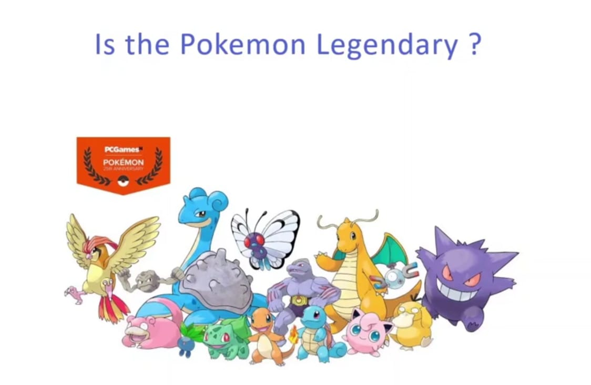

  
 

<h3> Link to Site- https://pokemon-proj.herokuapp.com/ </h3>

 <i> <h2>  Aim of this Project </h2>

<h3><i>Aim of this project is to find if the pokemon is legendary or not :) Well on a serious note, this project aims to showcase the importance of feature engineering and understanding of the data. We have alot of categorical columns in this dataset and we will understand how to handle these categorical data. </h2>

 

<h2> Details of the Project

<h3> The Project is divided into three parts
<h3>1.Building a machine learning model to predict if pokemon is legendary or not.
<h3>2. We build a web app on Django to mount the prediction model.
<h3>3. We deploy the Django project on Heroku through github.

     
  
 
<h2>Machine Learning Model
<h3> So we start off with building a machine learning model and train that model using the pokemon dataset. Here before we build a model, will understand about the data and what all methods can be applied to preprocess the data. </h3>
    

 

     
  
  <h1> Screenshots </h1>
  <h2> Input Screen </h2>
 
   
  
    
  
<h2> Output Screen </h2> 

   
  
    

### Give It a Star if you liked the project 
